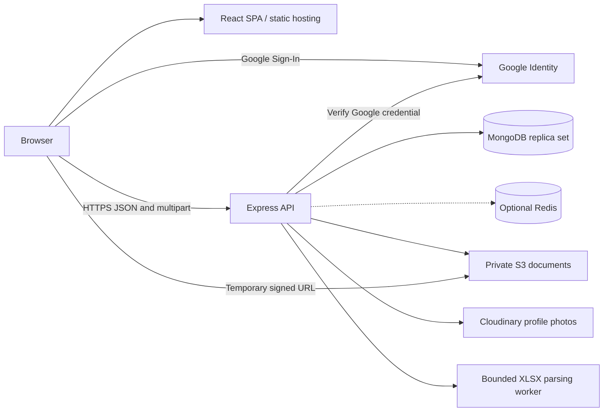

# Architecture

The portal is a single-college application with a React browser client and an Express API. MongoDB owns account, placement, and workflow state. The API enforces access and business rules; the frontend presents that state and collects user input.

This document describes the current source and intended production topology. It does not certify that a particular hosted deployment is running this revision. Start with [Getting started](GETTING_STARTED.md) for local setup and [Deployment](DEPLOYMENT.md) for environment preparation and release verification.

## Runtime topology

| Component | Responsibility |
| --- | --- |
| Frontend | React, React Router, and Axios; Vite produces static assets. The intended host is Vercel, with an SPA rewrite for direct navigation. |
| API | A long-running Node.js process using Express and Mongoose, intended for Render. It handles authentication, validation, database transactions, uploads, and exports. |
| MongoDB | The system of record. Transactions require a replica set or a compatible managed deployment such as Atlas. A standalone MongoDB server is insufficient for the main write workflows. |
| Redis | Optional integration with bounded connection and command timeouts. Current company-list requests query MongoDB directly so publishing and permissions are current; Redis is not required for data correctness. |
| S3 | Stores resumes and shared or role-specific documents. MongoDB stores object metadata and references. Authorized API requests issue temporary download URLs. |
| Cloudinary | Stores profile photos; MongoDB stores the photo URL and public ID. |
| Google Identity | Verifies identity at sign-in. Portal admission, roles, and permissions remain application decisions. |
| XLSX worker | Parses recruiter workbooks outside the API event loop with bounded concurrency, memory, expansion, and execution time. It is created within the backend process, not a separate deployed service. |

There is no queue service, WebSocket service, or scheduled notification worker. In-app notifications use database records and browser polling. The current workflows do not send recruiter or student email.

The repository's Dockerfiles and Compose configuration run Vite and nodemon for development. They do not define the production static-frontend and API deployment.

## API startup and request lifecycle

[`backend/server.js`](../backend/server.js) is the production entry point. It validates required configuration, connects to MongoDB, checks the foundation migration record and the unique student/drive application index, starts the optional Redis connection, and then listens. Indexes and collections are installed by explicit setup scripts; Mongoose automatic creation and indexing are disabled in [`config/db.js`](../backend/config/db.js).

[`backend/app.js`](../backend/app.js) exports `createApp()` separately so tests can create the HTTP application without starting the production server or connecting to external services. The request pipeline applies response headers, compression, CORS, cookie parsing, origin protection, bounded body parsers, and rate limits before routing. Routes apply their account/permission guards and validators, then call controllers or services. A final error handler returns consistent API errors.

`GET /health` reports that the HTTP process is responding. It does not actively test database, Google, or file-storage availability on each call. Deployment checks must exercise those dependencies separately.

The API route families are mounted under `/api/auth`, `/api/admin`, `/api/company`, `/api/application`, `/api/recruitment`, `/api/reports`, `/api/student`, and `/api/v1/upload`. The full route inventory, request contracts, and response shapes belong in [API](API.md); access controls and resource limits belong in [Security](SECURITY.md).

## Domain boundaries

| Area | Source of truth and boundary |
| --- | --- |
| Accounts and student admission | `Admin` holds staff identities. `ApprovedStudent` holds the allowed student email roster. `Student` holds registered student profiles. A roster row alone is not a registered student. |
| Placement listings | `Company` identifies the listing and points to its current `Drive`. The drive holds publication state and shared details; `JobRole` holds each role's eligibility, compensation, documents, and rounds. Company summary fields support compatible list responses. |
| Applications | One `Application` binds a student to one role in a drive. Its original snapshot records what was submitted; later profile edits do not rewrite it. Corrections are retained as reviewed requests. |
| Recruitment | `RecruiterResult` stores a preview and the exact changes of a published batch. Publishing verifies that its drive and applicant context is still current. Offers are recorded separately from shortlist results. |
| Placement rules and reports | A singleton `PlacementPolicy` controls when an offer counts as placement and whether placed students can apply again. Reports aggregate current student and application records rather than storing a second reporting database. |
| Notifications and audit | Notifications are student-facing updates with separate read receipts. Audit records retain staff actions; the admin profile reads only the most recent five actions for its account. |

The schema can relate multiple drives to a company, but current publishing and browsing resolve the listing through `Company.defaultDrive`. Do not assume a multi-drive company-management workflow exists merely because the references permit one. The college policy and access-management control records are also singletons; the current application has no tenant boundary for multiple colleges.

See [Data model](DATA_MODEL.md) for relationships and invariants, and [Workflows](WORKFLOWS.md) for application, publishing, recruitment, and placement behavior.

## Frontend organization and state

[`src/App.jsx`](../frontend/src/App.jsx) defines browser routes and wraps them in `AuthProvider` and `NotificationProvider`. `RequireSession` gates student, staff, Super Admin, permission-specific, and profile-completion routes. These gates improve navigation; backend authorization remains authoritative.

| Surface | Main implementation |
| --- | --- |
| Sign-in and session recovery | [`pages/Login.jsx`](../frontend/src/pages/Login.jsx), [`auth/`](../frontend/src/auth), [`api/axios.js`](../frontend/src/api/axios.js) |
| Student opportunities and role details | [`pages/Dashboard.jsx`](../frontend/src/pages/Dashboard.jsx), [`pages/StudentViewCompany.jsx`](../frontend/src/pages/StudentViewCompany.jsx), [`components/StudentRoleDialog.jsx`](../frontend/src/components/StudentRoleDialog.jsx) |
| Student profile | [`pages/Profile.jsx`](../frontend/src/pages/Profile.jsx), [`pages/CompleteProfile.jsx`](../frontend/src/pages/CompleteProfile.jsx), profile and academic field components |
| Student applications | [`pages/MyApplications.jsx`](../frontend/src/pages/MyApplications.jsx), [`components/ApplicationProgress.jsx`](../frontend/src/components/ApplicationProgress.jsx), [`components/StudentApplicationDialog.jsx`](../frontend/src/components/StudentApplicationDialog.jsx) |
| Notification inbox | [`pages/Notifications.jsx`](../frontend/src/pages/Notifications.jsx), [`notifications/`](../frontend/src/notifications) |
| Staff dashboards and student roster | [`pages/AdminDashboard.jsx`](../frontend/src/pages/AdminDashboard.jsx), [`pages/AdminStudents.jsx`](../frontend/src/pages/AdminStudents.jsx), [`components/StudentEmailImport.jsx`](../frontend/src/components/StudentEmailImport.jsx) |
| Staff accounts, policy, and activity | [`pages/AdminAccounts.jsx`](../frontend/src/pages/AdminAccounts.jsx), [`components/PlacementPolicyEditor.jsx`](../frontend/src/components/PlacementPolicyEditor.jsx), [`pages/AdminProfile.jsx`](../frontend/src/pages/AdminProfile.jsx) |
| Drive editing | [`components/DriveEditor.jsx`](../frontend/src/components/DriveEditor.jsx), [`components/DriveRoleEditor.jsx`](../frontend/src/components/DriveRoleEditor.jsx); shared by create/edit pages |
| Applicant review and recruitment | [`pages/AdminCompanyRoles.jsx`](../frontend/src/pages/AdminCompanyRoles.jsx), [`pages/AdminViewApplications.jsx`](../frontend/src/pages/AdminViewApplications.jsx), [`components/RecruitmentWorkspace.jsx`](../frontend/src/components/RecruitmentWorkspace.jsx), [`components/OfferActions.jsx`](../frontend/src/components/OfferActions.jsx) |
| Placement reporting | [`pages/PlacementReports.jsx`](../frontend/src/pages/PlacementReports.jsx) |

Pages use compact, responsive panels and paginated lists. Role editors and detail views use dialogs or tabs to keep the main page concise. Smaller viewports and long content retain scrolling within the relevant panel; fixed desktop dimensions are not a data limit.

State is divided by lifetime:

- **Authenticated account:** `AuthProvider` restores the current profile through the API. Browser storage caches the serialized user for navigation, not an authorization token. Server session cookies are sent by the shared Axios client. Concurrent 401 responses share one refresh request and retry once; temporary server/network failures do not erase a session as though access were revoked.
- **Page data:** pages and `usePagedQuery` fetch server-filtered results. Query changes abort old requests, and request keys prevent stale results from replacing newer filters. Search is debounced where used; changing filters resets pagination.
- **Unsaved forms:** component state owns draft edits. The drive editor keeps all role drafts while switching the selected role and editing tab. Saving sends the drive's role collection with its revision.
- **Notifications:** `NotificationProvider` polls every 60 seconds while visible and refreshes on focus, visibility changes, and relevant actions. The server returns counts, read state, and a page of results.
- **Guest demo:** permitted student pages use a synthetic profile and session-storage application records. Guest actions do not create authenticated applications or grant access to protected profile/inbox routes.

The backend academic catalog in [`config/academicPrograms.js`](../backend/config/academicPrograms.js) is exposed to form components through `/api/academics`. The current catalog covers B.Tech, B.Com, M.Com, BBA, and MBA; eligibility keeps course/branch pairs together. Frontend eligibility helpers provide feedback, while the API rechecks the accepted profile and role at submission.

## Consistency and external effects

Related database writes use Mongoose transactions: publishing a drive, accepting an application, committing a roster, applying recruitment results, and recording offers must not partially commit. Explicit revision checks produce conflicts for stale editors. Shared write counters serialize operations that would otherwise race across documents. The counters have different purposes; see [Revision and concurrency fields](DATA_MODEL.md#revision-and-concurrency-fields) before changing one.

An application submission re-reads the student, role, drive, current policy, and resume reference inside the transaction. It checks eligibility and the deadline again, then writes the application, history, notification, and company count. The database unique index remains the final duplicate-submission constraint.

S3 and Cloudinary are outside MongoDB transactions. Document services upload the new object before committing metadata and keep historical references. If the database result is uncertain, cleanup retains an object that may have committed instead of deleting potentially referenced data. This can require later reconciliation of unreferenced uploads; it is not a distributed transaction.

Current listing, applicant, and report services push filtering, ordering, counts, and pagination into MongoDB. Pagination limits response size; it does not guarantee that every search or aggregate can avoid scanning records. Capacity assessment must use the intended hosting resources and data distribution, as described in [Testing](TESTING.md) and [Deployment](DEPLOYMENT.md).

## Backend source map

| Directory or file | Responsibility |
| --- | --- |
| [`routes/`](../backend/routes) | Mounted paths, route-specific authorization, validation, and upload middleware. |
| [`controllers/`](../backend/controllers) | HTTP orchestration and response serialization; some existing transactional workflows live here. |
| [`services/`](../backend/services) | Publishing, eligibility, roster parsing, applications, recruitment, offers, reports, notifications, and external storage operations. |
| [`models/`](../backend/models) | Persisted schemas, relationships, declared indexes, and embedded snapshot/document types. |
| [`validators/`](../backend/validators) | Accepted input shapes and normalized query/profile/drive/recruitment values. |
| [`middleware/`](../backend/middleware) | Sessions, permissions, origin checks, errors, rate limits, and buffered-upload admission. |
| [`config/`](../backend/config) | Environment validation, clients, cookie/CORS configuration, permission keys, and academic catalog. |
| [`migrations/`](../backend/migrations) and [`scripts/`](../backend/scripts) | Explicit database preparation, owner bootstrap, synthetic previews, rehearsal, and capacity tooling. Historical script filenames remain stable. |
| [`tests/`](../backend/tests) and [`frontend/tests/`](../frontend/tests) | Unit/API checks, pure frontend logic checks, and isolated replica-set integration tests. |

For change boundaries and review expectations, see [Contributing](CONTRIBUTING.md). Avoid creating parallel implementations of a shared rule: extend the existing validator/service and its regression coverage.
