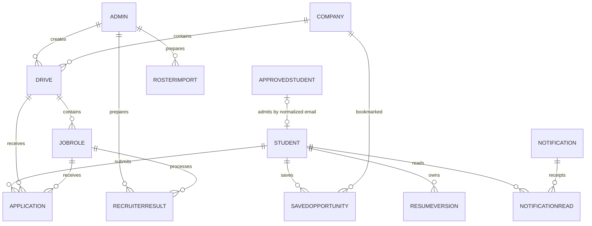

# Data model

MongoDB is the authoritative store for portal accounts, placement drives, applications, and their history. Mongoose model definitions are in [`backend/models/`](../backend/models). References are application-level relationships, not database-enforced foreign keys; services and transactions preserve their consistency.

All collections belong to the database selected explicitly by configuration. There is no separate database for administrators and no per-college tenant identifier. The current system serves one college. For runtime boundaries see [Architecture](ARCHITECTURE.md); for setup commands see [Getting started](GETTING_STARTED.md) and [Deployment](DEPLOYMENT.md).

## Core relationships

`Company.defaultDrive` identifies the drive used by current browsing and publishing, and `Company.defaultRole` identifies its compatibility role. Although the references allow multiple drives per company, current creation produces a company, one drive, and its roles together. Every application stores explicit student, company, drive, and role IDs.

## Collections

### Accounts and admission

| Collection | Model and purpose | Important relationships and state |
| --- | --- | --- |
| `approvedstudents` | [`ApprovedStudent`](../backend/models/ApprovedStudent.js): allowed student emails and access status. | Normalized unique email, `isActive`, optional roster details, `revision`. Role is restricted to `student`. A row may exist before its first sign-in. |
| `students` | [`Student`](../backend/models/Student.js): registered students and their current profiles. | Unique email, Google identity binding, academic profile, portfolio/projects, current resume reference, profile completion, and placement status. Admission is looked up by email in the roster. |
| `admins` | [`Admin`](../backend/models/Admin.js): staff identities and access. | Unique email, role (`admin` or `super_admin`), permission keys, active state, and revision. Staff are not student records. |
| `authsessions` | [`AuthSession`](../backend/models/AuthSession.js): independent login sessions. | String session ID, account ID plus `userModel` (`Student`/`Admin`), refresh-token hash, and expiry. |
| `admincontrols` | [`AdminControl`](../backend/models/AdminControl.js): transaction coordination. | Singleton `_id: "admin-access"`; incrementing its revision serializes staff identity changes and roster commits. It is not another account or permission record. |
| `rosterimports` | [`RosterImport`](../backend/models/RosterImport.js): saved roster preview. | Preparing admin, parsed rows/summary, `PREVIEW` or `COMMITTED`, commit time, and expiry. Commit uses the saved preview and rechecks current accounts. |

Staff and student emails cannot be claimed through both admission paths by supported account-management operations. The individual email indexes enforce uniqueness within each collection; cross-collection exclusivity is enforced by the service transaction and access-control record.

Roster metadata and a submitted student profile serve different purposes. Importing an existing email preserves its details and enabled/disabled state. Student profile updates do not require a separate staff-verification record. Reports count registered `students`, including incomplete or disabled accounts, and exclude roster emails that have never registered.

Each login creates its own `AuthSession`; `userModel` resolves whether its account reference belongs to `Student` or `Admin`. The session stores a SHA-256 hash of the refresh token, not the raw token. Access tokens last 15 minutes and refresh sessions have a fixed seven-day expiry. Refresh does not extend that expiry or create a replacement session. Logout removes the current session; staff access changes and account revocation invalidate affected sessions. See [Security](SECURITY.md) for the authentication protocol and cookie configuration.

### Companies, applications, and files

| Collection | Model and purpose | Important relationships and state |
| --- | --- | --- |
| `companies` | [`Company`](../backend/models/Company.js): listing identity and compatibility summary. | Company name, creator, `defaultDrive`, `defaultRole`, legacy summary fields, and retained total-applicant counter. |
| `drives` | [`Drive`](../backend/models/Drive.js): shared recruiting information. | Company, title/description, deadline, `DRAFT`/`PUBLISHED`/`CLOSED`, dream-opportunity flag, `ONE_ROLE` policy, current/retired shared documents, fallback rounds, revision, and activity counter. |
| `jobroles` | [`JobRole`](../backend/models/JobRole.js): role-specific terms. | Drive, title, employment type, location, compensation, eligibility, resume requirement, current/retired documents, rounds, finalized round keys, active flag, and display order. |
| `applications` | [`Application`](../backend/models/Application.js): one student's submission and progress. | Student/company/drive/role IDs, original immutable snapshot, status, current round, offer, timeline, reviewed requests, and recruitment revision. |
| `resumeversions` | [`ResumeVersion`](../backend/models/ResumeVersion.js): retained uploaded resume metadata. | Owning student, unique S3 object key, filename/content type, upload time, and legacy-import marker. The student's current resume points to a version. |

The authoritative drive and role details are not the flattened company fields. [`publishingService.js`](../backend/services/publishingService.js) updates those fields for compatibility when the drive changes. Current staff dashboard application counts are queried from `applications` for the requested page rather than trusting the summary counter.

Role eligibility stores course/branch groups, optional graduating years, academic cutoffs, and backlog rules. The backend's [academic catalog](../backend/config/academicPrograms.js) normalizes current input; older branch-only criteria remain supported for existing records. Compensation supports descriptive text and historical numeric amounts with explicit currency, kind, and period.

Each role can define its own rounds. `roundsFor(drive, role)` falls back to the drive's round array when the role has none. Once applications exist for a role, its existing round sequence cannot be renamed, removed, or reordered; new rounds can be appended. Removing a role from an update marks it inactive and preserves its application history.

### Results, policy, notifications, and audit

| Collection | Model and purpose | Important relationships and state |
| --- | --- | --- |
| `recruiterresults` | [`RecruiterResult`](../backend/models/RecruiterResult.js): preview and published recruitment batch. | Actor, company/drive/role, source and target rounds, partial/final mode, fingerprint, selected/rejected application IDs, diagnostic preview, exact before/after changes, and `PREVIEW`/`PUBLISHED`/`UNDONE` state. |
| `placementpolicies` | [`PlacementPolicy`](../backend/models/PlacementPolicy.js): college placement rules. | Singleton `_id: "college"`; placement milestone (`ACCEPTED`/`JOINED`), further-application rule (`ALLOW`/`BLOCK`/`DREAM_ONLY`), revision, and activity counter. |
| `notifications` | [`Notification`](../backend/models/Notification.js): in-app update. | Deterministic string ID, optional student recipient, type, title/message, related company/application, creation time, and optional expiry. A null recipient denotes a broadcast. |
| `notificationreads` | [`NotificationRead`](../backend/models/NotificationRead.js): student read receipt. | Deterministic student/notification ID, references, and read time. Reading a broadcast does not change it for other students. |
| `savedopportunities` | [`SavedOpportunity`](../backend/models/SavedOpportunity.js): saved listing. | Deterministic student/company ID and reminder preference. |
| `auditlogs` | [`AuditLog`](../backend/models/AuditLog.js): durable administrative event. | Actor ID/model, action, target, details, and creation time. The profile's five-item recent-activity display does not truncate stored audit history. |
| `migrationruns` | [`MigrationRun`](../backend/models/MigrationRun.js): foundation migration state. | Migration ID, applied/rolled-back status, index readiness, backup reference, summary, and data fingerprint. |
| `migrationbackups` | [`MigrationBackup`](../backend/models/MigrationBackup.js): reversible migration operations. | Migration backup ID, target collection/source ID, and before/after records. These are sensitive data copies, not ordinary application history. |

## Original submissions and corrections

`Application.snapshot` is required and declared immutable. It captures the accepted profile, academic/contact details, portfolio and projects, resume version, drive/role titles, compensation, documents, and recruitment plan. Later profile edits, resume uploads, role edits, or document replacement do not rewrite that original submission.

A correction request embeds a separate `proposedSnapshot`. It uses the student's current validated profile and resume while retaining the original role/drive terms and document/round snapshot. Staff approval changes which profile is effective for review; it does not replace `Application.snapshot`. The latest approved correction is exposed as `effectiveSnapshot` and used by applicant search and recruiter exports. Eligibility warnings are retained for honest corrections that fall below a cutoff.

Requests also retain reason, status, requested/resolved times, staff response, and resolving admin. Only one pending request is allowed, and the array is capped at 20 requests per application. An approved withdrawal sets `WITHDRAWN` and preserves the application. The unique student/drive constraint therefore still prevents reapplication after withdrawal.

Application status, current round, and offer status represent different facts. A shortlist can reach `SELECTED` without an offer. The embedded current offer can be `ISSUED`, `ACCEPTED`, `JOINED`, `DECLINED`, or `REVOKED`; its changes append timeline events. The policy service derives student placement status from qualifying offers while preserving earlier recorded placements. See [Workflows](WORKFLOWS.md) for allowed transitions.

Report grouping uses each student's current course, branch, and graduating year. Applicant review and exports use submitted or approved-correction details. Those values can legitimately differ; changing a profile must not silently rewrite a past application to make reports appear identical.

## Document history and retention

The shared [document schema](../backend/models/schemas/document.js) stores identifiers, S3 keys, filenames, content types, upload times, and optional resume-version references. Object bytes remain in S3. A stored URL is metadata, not proof the object is publicly readable; downloads use authorized, short-lived signed URLs.

Resumes create a new `ResumeVersion`, then update the student's current reference and profile version. Drive/role document replacement moves the previous attachment to `retiredAttachments`. Applications retain the documents and resume version that existed at submission. Services check current or historical ownership before issuing a download URL.

External object writes are not part of MongoDB transactions. Upload compensation checks whether a new object was committed before deleting it after a failure. If that check cannot establish absence, the object is retained for reconciliation rather than risking a broken reference.

Applications and published result batches have no automatic TTL. Company deletion is rejected when applications reference the company; closing a drive preserves history. Notification expiry filters the inbox, and stale deadline reminders are removed during synchronization; the notification schema does not declare a TTL index. Do not assume expired notifications or retained files are automatically purged. Retention and backup procedures belong in [Deployment](DEPLOYMENT.md) and [Security](SECURITY.md).

## Revision and concurrency fields

These explicit fields are part of the service contracts; Mongoose's default `__v` is not their substitute.

| Field | Purpose |
| --- | --- |
| `Admin.revision`, `ApprovedStudent.revision` | Reject stale staff/roster edits. |
| `AdminControl.revision` | Forces conflicting account/roster transactions to serialize around cross-collection identity decisions. |
| `Student.profileVersion` | Identifies the profile and current resume reviewed before submission. Profile edits and resume replacement increment it. |
| `Student.applicationVersion` | Creates a write conflict when submission/correction capture or placement recalculation races another student update. It is not a client-visible form revision. |
| `Drive.revision` | Rejects stale publishing, role, status, and document changes; can also detect stale application review. |
| `Drive.activityVersion` | Serializes submissions/results with drive edits without making the staff editor stale for every new application. |
| `Application.recruitmentRevision` | Tracks result, request, and offer activity; participates in stale-offer checks, preview fingerprints, and guarded batch undo. `updatedAt` is also checked for exact batch changes. |
| `PlacementPolicy.revision` | Rejects stale policy edits. |
| `PlacementPolicy.activityVersion` | Coordinates offer recording with policy changes and placement recalculation. |

`schemaVersion`, `publishingVersion`, `workflowVersion`, and `placementTrackingVersion` are compatibility markers describing stored record behavior. They are not counters for concurrent editor updates. Existing legacy records can lack some markers; services have explicit fallback behavior.

Recruiter previews fingerprint the drive revision, round definitions, finalized rounds, and applicant status/revision/update times. Publication checks that fingerprint inside its transaction. A repeated successful publication returns the existing result. Undo checks every affected application's exact published state and refuses to overwrite newer activity. A published batch retains IDs and changes while discarding redundant preview diagnostics.

## Constraints and indexes

Model files declare the indexes; setup scripts create them explicitly. A schema declaration alone does not mean an environment has the index installed.

| Constraint/index | Effect |
| --- | --- |
| Unique normalized `email` in `students`, `admins`, and `approvedstudents` | Prevents duplicate identities within each collection. Cross-collection checks still require the account services. |
| `applications.student_drive_unique` on `{ student: 1, drive: 1 }` | Enforces one application per student per drive, including simultaneous submissions and withdrawn records. It is partial for ObjectId-valued drive references to support migration. The server checks that this unique index exists at startup. |
| Sparse unique `legacyCompanyId` in `drives` and `jobroles` | Makes legacy company conversion repeatable without duplicating its drive/role pair. |
| Unique `resumeversions.key` | Prevents one object key being represented as multiple resume versions. |
| TTL `authsessions.expiresAt` and `rosterimports.expiresAt` | Removes expired session/preview records asynchronously. Runtime expiry checks still apply before the TTL monitor deletes them. |
| `recruiterresults.expire_unused_previews` | TTL on `expiresAt` only for `state: "PREVIEW"`; published/undone batches remain. Preview use also checks expiry explicitly. |
| Deterministic `_id` in `notifications`, `notificationreads`, and `savedopportunities` | Deduplicates repeat notifications, read receipts, and saved listings through the built-in unique ID index. |
| Unique migration/collection/source tuple in `migrationbackups` | Identifies one backed-up operation per source record within a migration backup. |

Additional indexes support account activity, student cohorts/name ordering, company ordering, drive/role/status application access, student application history, offer lookups, result history, and saved listings. The exact definitions are in the corresponding models and [`migrations/stage6.js`](../backend/migrations/stage6.js). Pagination bounds returned rows; contains-text searches and aggregate counts can still examine many matching records.

## Database preparation and compatibility

The historical script names are stable operational interfaces. Their numbers are not separate applications or a requirement to recreate the database.

| Script | Current purpose and repeat behavior |
| --- | --- |
| [`migrate-stage2.js`](../backend/scripts/migrate-stage2.js) | Foundation migration: separates historical staff from students, normalizes admission data, adds drive/role relationships and resume versions, preserves application snapshots, and installs core indexes. A completed `stage2-v1` run is recognized on repeat; missing declared indexes are checked/created again. |
| [`setup-stage4.js`](../backend/scripts/setup-stage4.js) | Creates notification, read-receipt, and saved-opportunity collections/indexes. Additive and repeatable. |
| [`setup-stage5.js`](../backend/scripts/setup-stage5.js) | Creates recruiter-result/policy collections and indexes plus application indexes. Inserts the default college policy only if absent, preserving later policy edits. |
| [`setup-stage6.js`](../backend/scripts/setup-stage6.js) | Adds declared list/report indexes to existing model collections without rewriting records or dropping existing indexes. |
| [`bootstrap-super-admin.js`](../backend/scripts/bootstrap-super-admin.js) | Promotes the initial existing active administrator through the account service. Repeat behavior recognizes an already-promoted account; it does not create a general bypass for later staff management. |

Database scripts default to inspection unless their mutation flag is supplied. Migration/setup scripts require an exact database name matching the configured URI, preferring `MIGRATION_MONGO_URI` over `MONGO_URI`. Follow [Deployment](DEPLOYMENT.md) for the actual commands, preparation order, backup, and rollout checks.

Startup requires `migrationruns` to contain `stage2-v1` with `status: "APPLIED"` and `indexesReady: true`, plus the actual unique student/drive index. Later setup has no separate startup migration marker. Recruitment imports, offer recording, and policy mutation explicitly reject missing placement-policy setup; passing startup alone does not prove every feature's collections and indexes are ready.

Foundation rollback is deliberately narrow: it compares current data with the post-migration fingerprint and refuses to overwrite subsequent activity. The retained backup-operation count must match the migration's recorded count; missing or purged operations block rollback. Its before/after records support rollback, but do not replace an independent database backup. See [Testing](TESTING.md) for isolated rehearsal.

Some compatibility fields remain even when absent from current forms: company single-role summaries, legacy `driveDate`, historical branch-only criteria, and the retired per-student refresh-token field. Active sessions use `AuthSession`, not that legacy field. Do not delete or reinterpret compatibility data without inspecting callers and migration behavior.

For endpoint payloads see [API](API.md). For changes to these contracts and their regression coverage, see [Contributing](CONTRIBUTING.md).
